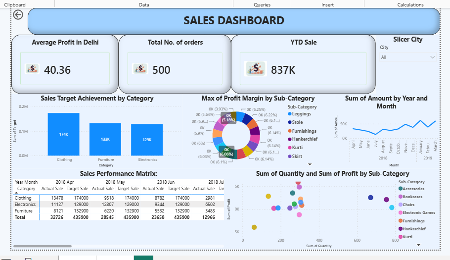
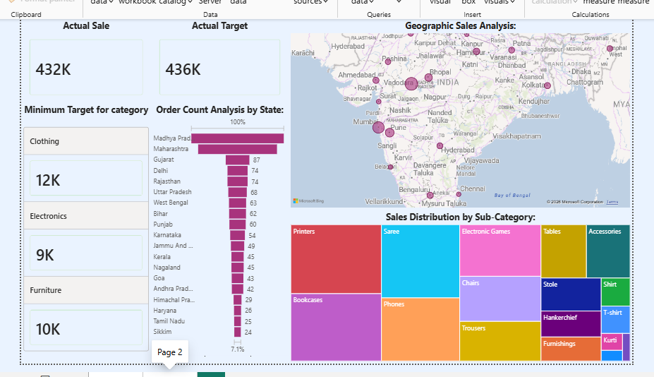

# 📊 Power BI Sales Performance & Geographic Analysis Dashboard
### Master Repository Portfolio & Technical Architecture Documentation

An end-to-end business intelligence solution designed to track, analyze, and optimize retail sales performance, profitability tiers, and regional distributions[cite: 4, 5]. This repository houses the interactive Power BI data model, data reconciliation configurations, automated DAX calculations, and granular architectural reporting files[cite: 4, 5].

---

## 📈 Part 1: Front-Page Repository Portal (README Setup)

### Strategic Key Performance Indicators (KPIs)
The top-level operational performance of the enterprise is continuously monitored via explicit, optimized DAX time-intelligence and conditional filtering metrics[cite: 4, 5]:

* **Total Number of Orders:** 500 unique transactions[cite: 4, 5].
* **Year-to-Date (YTD) Revenue:** $837K in accumulated sales[cite: 4, 5].
* **Target-Filtered Average Profitability:** $40.36 mean return per order within the Delhi region[cite: 4, 5].

### 🗺️ Report Architecture & Visual Layouts

The dashboard is structured into two specialized analytics views, breaking down high-level health metrics before diving into granular regional breakdowns[cite: 4, 5].

#### 🖥️ Page 1: Executive Overview Dashboard
This layout serves as the strategic summary for stakeholders to immediately review volume milestones against fixed organizational benchmarks[cite: 4, 5].

* **Dynamic Metric Cards:** Exposes isolated aggregations for running profits, distinct transaction volume, and temporal YTD sales velocity[cite: 4, 5].
* **Sales Target Achievement Matrix:** A tiered bar visualization comparing the Actual Sale amount against the assigned Target Sale benchmark across the three primary sectors: Clothing, Electronics, and Furniture[cite: 4, 5].
* **Categorical Profit Margin Breakdown:** A specialized donut visual isolating outlier profitability segments by individual product subtype like Leggings or Furnishings[cite: 4, 5].
* **Monthly Sales Volatility Trend:** A continuous line visualization tracking fiscal trajectory by evaluating total transactional amounts across intersecting Years and Months[cite: 4, 5].
* **Scatter Plot Performance Reconciler:** Maps the structural distribution of Sum of Quantity (x-axis) against Sum of Profit (y-axis) to pinpoint high-volume, low-margin products[cite: 4, 5].

#### 🌍 Page 2: Geographic & Sub-Category Analysis
This layout transitions from high-level volume metrics down to granular spatial execution and regional product affinity tracking[cite: 4, 5].

* **Geographic Spatial Mapping:** An active map visual providing localized bubble indicators proportional to sales volume across national and regional city boundaries[cite: 4, 5].
* **Proportional Order Volumetrics:** A dynamic funnel visual highlighting the market share of ordered items across regional divisions, leading with heavy concentrations in Madhya Pradesh, Maharashtra, and Gujarat[cite: 4, 5].
* **Sub-Category Treemap Matrix:** A nested geometric tile breakdown clustering market performance weight across specific product types like Printers, Sarees, Chairs, Bookcases, and Handkerchiefs[cite: 4, 5].

---

## 🧮 Part 2: Engineering Architecture & DAX Schema

The semantic layer of this workbook utilizes custom-engineered DAX calculations to normalize the underlying tables and handle transaction tracking automatically[cite: 4, 5]:

### Calculated Columns (Table Transformation Layer)

* **Category Type**
  Formula: Category type = 'Order Details'[Category] & " " & 'Order Details'[Sub-Category]
  Analytical Purpose: Combines primary product boundaries with explicit item types to build an optimal single-string index for cross-visual slicing[cite: 4, 5].

* **Revenue per Order**
  Formula: Revenue per Order = 'Order Details'[Amount] * 'Order Details'[Quantity]
  Analytical Purpose: Calculates gross transaction value per line item by scaling transaction amounts against raw quantity dimensions[cite: 4, 5].

* **Sales Category**
  Formula: Sales Category = IF('Order Details'[Amount] > AVERAGE('Order Details'[Amount]), "Above Average", "Below Average")
  Analytical Purpose: Evaluates row-level financial weight against the overall transaction average to dynamically categorize items as performance leaders or laggards[cite: 4, 5].

### Explicit Measures (Calculations Layer)

* **Total No. of Orders**
  Formula: total No. of Orders = DISTINCTCOUNT('Order Details'[Order ID])
  Analytical Purpose: Performs a clean count of actual order transactions by filtering out duplicates caused by multi-item baskets[cite: 4, 5].

* **Average Profit in Delhi**
  Formula: Average Profit in Delhi = CALCULATE(AVERAGE('Order Details'[Profit]), 'List of Orders'[State]="Delhi")
  Analytical Purpose: Overwrites default reporting context using boolean modifiers to calculate exact profit performance inside the Delhi urban cluster[cite: 4, 5].

* **Year-to-Date (YTD) Sales**
  Formula: YTD Sale = TOTALYTD(SUM('Order Details'[Revenue per Order]), 'List of Orders'[Order Date])
  Analytical Purpose: Generates continuous running totals of calculated revenues, resetting automatically with the fiscal calendar to monitor growth targets[cite: 4, 5].

---

## 🛠️ Part 3: Project Deep-Dive & Functional Breakdown

### Project Overview & Business Strategy
In the modern e-commerce lifecycle, business leaders rely heavily on robust data pipelines to uncover performance gaps, geographic layout variations, and product line margins[cite: 5]. The primary goal of this implementation is to translate siloed operational data tables into a unified analytical schema capable of projecting regional sales velocity and evaluating performance gaps in real time[cite: 5].

### Detailed Dashboard Visual Specifications

1. **Macro Operational Cards (Page 2 Overview):** Positioned at the top left to show overall baseline performance, including an Actual Sale total of $432K alongside a Target benchmark of $436K[cite: 4, 5].
2. **Minimum Category Thresholds:** A multi-row card that outputs the minimum baseline target metrics for each catalog track: Clothing ($12K), Electronics ($9K), and Furniture ($10K)[cite: 4, 5].
3. **Geographic Sales Bubble Map:** An interactive geospatial visualization using proportional bubbles over cities to visually highlight high-performing geographic hubs[cite: 4, 5].
4. **Order Count Volume Funnel:** A clean funnel chart highlighting product distribution velocity across domestic territories, showing strong concentrations in Madhya Pradesh, Maharashtra, and Gujarat[cite: 4, 5].
5. **Sub-Category Treemap Matrix:** A nested categorical block chart layout that tiles market share across key items such as Printers, Sarees, Chairs, and Bookcases[cite: 4, 5].

---

## 📂 Part 4: Repository Blueprint & Operational Checksheet

### Repository File Layout
* **Page1.png** - Executive Summary Page Screenshot
* **Page2.png** - Geographic Layout Page Screenshot
* **PowerBI Assignment 2.pbix** - Master Power BI Desktop dashboard file
* **Technical_Documentation.pdf** - Full compilation of formula audit reports
* **README.md** - Front-page repository portal documentation

### Project Delivery Checksheet
* [x] Clean star-schema relational model built and validated[cite: 5].
* [x] Calculated columns configured with performance-optimized DAX formulas[cite: 4, 5].
* [x] Time-intelligence measures validated against historical accounting data[cite: 4, 5].
* [x] Chart labels, dynamic tooltips, and cross-filtering slicers fully verified for end-users[cite: 4, 5].
